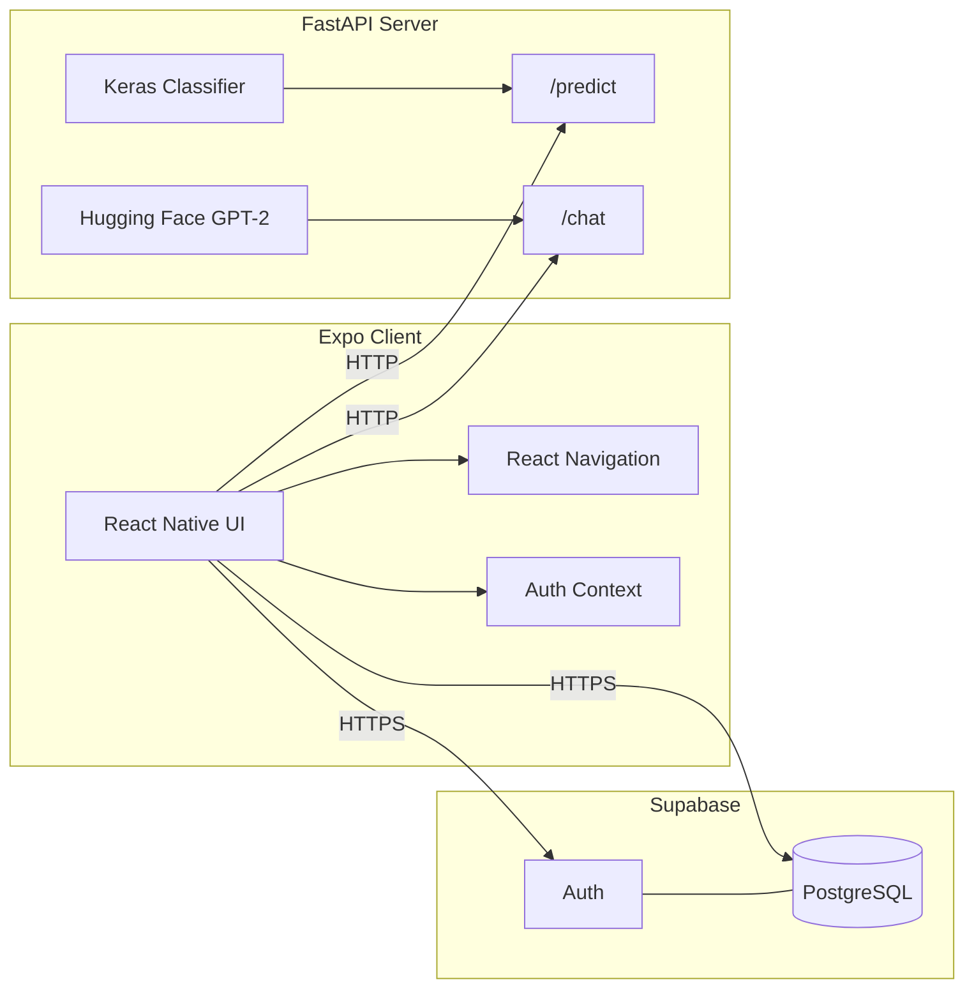

# Plant Disease Detection

Cross-platform mobile app for **plant image classification**, **scan history**, **community discussion**, and **AI-assisted crop-care Q&A**. The system combines an **Expo (React Native)** client, a **FastAPI** inference service (TensorFlow + optional text generation), and **Supabase** (PostgreSQL + authentication).

**What this repo demonstrates:** full-stack mobile development, authenticated CRUD against a hosted database, REST integration with a Python ML service, and separation of concerns between client, API, and data layers—useful for portfolios and technical interviews.

---

## Architecture



- **Client:** Session-aware navigation; authenticated users sync scans and forum data to Supabase; disease scan and chat call the FastAPI host.
- **Supabase:** Email/password auth and tables for `scans`, `posts`, and `comments`.
- **FastAPI:** Loads `plant_disease_model.h5` for image classification; `/chat` uses `transformers` + PyTorch with the `gpt2` model for text generation.

---

## Tech stack

| Layer | Technologies |
|--------|----------------|
| **Mobile** | Expo ~52, React 18, React Native, React Navigation (stack), React Native Paper, React Native Vector Icons |
| **State & data** | React Context (`UserContext`), Supabase JS client, `fetch` / Axios |
| **Media** | `react-native-image-picker` (gallery + camera) |
| **Backend (ML)** | Python 3, FastAPI, Uvicorn, TensorFlow/Keras, Pillow, NumPy |
| **NLP** | Hugging Face `transformers`, PyTorch (`gpt2` for `/chat`) |
| **BaaS** | Supabase Auth + PostgreSQL |

See `client/my-new-project/package.json` and `server/requirements.txt` for pinned versions.

---

## Repository structure

```
plantDiseaseDetection/
├── client/my-new-project/     # Expo application
│   ├── App.js                   # Root: auth provider + navigator
│   ├── RootNavigator.js         # Auth stack vs app stack
│   ├── app.config.js            # Expo config + env injection
│   ├── supabaseClient.js        # Supabase singleton
│   ├── context/UserContext.js   # Session, signUp, signIn, logOut
│   ├── auth/                    # Login, Signup
│   └── pages/                   # Home, ScanImage, HistoryPage, CommunityForum, CropCareTips, Welcome
└── server/
    ├── main.py                  # FastAPI app, /predict, /chat
    ├── requirements.txt
    └── plant_disease_model.h5   # Trained weights (you provide)
```

---

## Features

| Area | Implementation notes |
|------|----------------------|
| **Authentication** | Supabase email/password; `RootNavigator` switches between auth and main stacks based on session (`UserContext`). |
| **Disease scan** | Image from gallery or camera → `POST /predict/` → label + confidence; result persisted to `scans` with `user_id`, `scan_date`, `image_uri`, `diagnosis`. |
| **History** | Lists user scans with filters (all / healthy / diseased), detail modal, delete; pull-to-refresh. |
| **Crop care chat** | Client → `POST /chat/`; server returns generated text (GPT-2). |
| **Community forum** | `posts` and `comments` in Supabase; search, category filters, CRUD on own posts, threaded comments. |

---

## REST API (`server/main.py`)

Base URL in development: `http://127.0.0.1:8000` (see client `fetch` calls in `ScanImage.js`, `CropCareTips.js`).

| Method | Path | Request body | Response |
|--------|------|----------------|----------|
| `POST` | `/predict/` | `{ "image_uri": string }` | `{ "predicted_class": string, "confidence": number }` |
| `POST` | `/chat/` | `{ "query": string }` | `{ "response": string }` |

**Classification labels** (from `index_to_label` in `main.py`): `Bacterial_Disease`, `Environmental_Stress`, `Fungal_Disease`, `Healthy`, `Viral_Disease`.

**Input shape:** images are resized to **224×224** and normalized before inference.

**CORS:** `CORSMiddleware` allows `http://localhost:8081` (Expo web). Extend `allow_origins` for other dev hosts or production URLs.

---

## Supabase schema (expected)

Configure `client/my-new-project/.env`:

| Variable | Purpose |
|----------|---------|
| `EXPO_PUBLIC_SUPABASE_URL` | Project URL |
| `EXPO_PUBLIC_SUPABASE_ANON_KEY` | Public anon key (used with RLS policies) |

Values are read via `app.config.js` → `Constants.expoConfig.extra` in `supabaseClient.js`.

| Table | Columns used by the app |
|-------|-------------------------|
| `scans` | `id`, `user_id`, `scan_date`, `image_uri`, `diagnosis` |
| `posts` | `id`, `user_id`, `title`, `content`, `category`, `created_at` |
| `comments` | `id`, `post_id`, `user_id`, `content`, `created_at` |

**Security:** enable Row Level Security and policies so users only access their own rows where appropriate; the client relies on the anon key plus authenticated `user.id`.

---

## Local development

### Prerequisites

- Node.js (LTS) and npm  
- Python 3.10+ recommended  
- Expo CLI via `npx expo` (no global install required)  
- Supabase project (URL + anon key)  
- Optional: Android Studio / Xcode for emulators  

### 1. ML API

```bash
cd server
python -m venv .venv
# Windows: .venv\Scripts\activate
# macOS/Linux: source .venv/bin/activate
pip install -r requirements.txt
```

Place **`plant_disease_model.h5`** in `server/` (path is `MODEL_PATH` in `main.py`).

```bash
uvicorn main:app --reload --host 0.0.0.0 --port 8000
```

Interactive docs: `http://127.0.0.1:8000/docs` (OpenAPI/Swagger).

### 2. Expo client

```bash
cd client/my-new-project
# Create .env with EXPO_PUBLIC_SUPABASE_URL and EXPO_PUBLIC_SUPABASE_ANON_KEY
npm install
npx expo start
```

Use `npm run android`, `npm run ios`, or `npm run web` as needed.

### Device networking

The app targets **`http://127.0.0.1:8000`**. That works for simulators/emulators on the same machine. For a **physical device**, replace the host with your computer’s LAN IP (or a tunnel such as ngrok) and update the URLs in `ScanImage.js` and `CropCareTips.js`.

---

## Engineering notes

- **Image payload:** The server decodes **base64** in `image_uri`. The current picker flow may send a **local `file://` URI** instead; align client and server (e.g. `includeBase64: true` in image picker options, or server-side file read) before relying on predictions in production.
- **Model weights:** `plant_disease_model.h5` is not committed; training pipeline is out of scope for this README.
- **Chat model:** `/chat` uses small GPT-2; responses are generic and not fine-tuned for agronomy—suitable for demos, not production agronomic advice without further work.

---

## License

Client package license is defined in `client/my-new-project/package.json` (`license` field).
